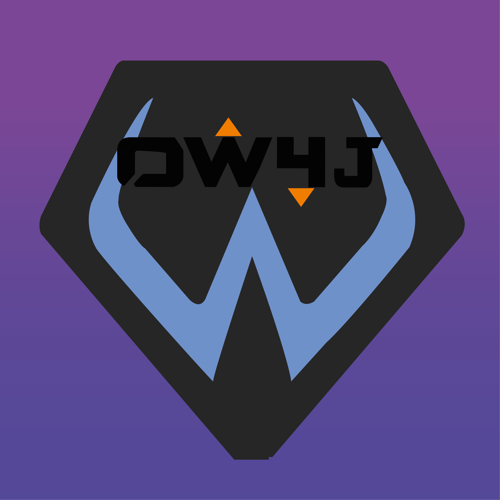

#OW4J


OW4J is a Java library which permits you to retrieve players' statistics from the official [Overwatch](https://playeroverwatch.com) website.

   

## Description
With OW4J, you can retrieve all players' information including competitive and quickplay games statistics, heroes statistics, achievements and more...

## Add to your project
This library can be added to your buildpath locally using your IDE (Eclipse: Java Build Path -> Depedencies, IntelliJ IDEA: Project Structure -> Librairies).

You can also use Maven or Gradle to add this library.

Maven:
- Dependency:
```xml
<dependency>
	<groupId>tech.hokkaydo</groupId>
	<artifactId>ow4j</artifactId>
	<version>version</version>
</dependency>
```

Gradle:
- Repository
```gradle
repositories {
	mavenCentral()
}
```
- Dependency
```gradle
dependencies {
	implementation 'tech.hokkaydo:ow4j:version'
}
```

## Usage
- **Coming Soon**

## Contributing
You can contribute to this project by creating Issues and upgrading the project.
see [CONTRIBUTING.md](https://github.com/Hokkaydo/OW4J/blob/master/CONTRIBUTING.md) for more informations


If this project helped you, don't forget to help it by giving a star <3
